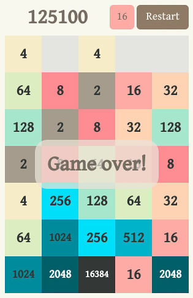

Eltzi's Tetris 2048
===================

A clone of an iPhone game now gone from the App Store, inspired by [Tetris](https://en.wikipedia.org/wiki/Tetris) and [2048][2048].

Made in HTML5/CSS/Javascript (all DOM, no canvas). **[Play it here!](http://castux.github.io/eltzi/)**

Controls
--------

- Use arrow keys or mouse on a computer, and touch on a mobile.
- Swipe left and right to move the falling block, swipe down to drop it.
- Tap "Change theme" to switch between the classic 2048 theme, and Eltzi's own theme.
- Tap "Fullscreen" to switch to full screen (should also work on most browsers, including mobile).

A real screenshot!
------------------

License
=======

Eltzi's Tetris 2048 is licensed under the [MIT License](LICENSE.txt). Distribute and modify at will!

`animframe_polyfill.js` and classic theme copied from [2048][2048], MIT License.

`performance_polyfill.js` by [Paul Irish][irish], MIT license.

Gentium Book Basic font from [Google Fonts](https://www.google.com/fonts/specimen/Gentium+Book+Basic), distributed under the [SIL Open Font License, 1.1](http://scripts.sil.org/cms/scripts/page.php?site_id=nrsi&id=OFL).

[2048]: https://github.com/gabrielecirulli/2048
[irish]: https://gist.github.com/paulirish/5438650